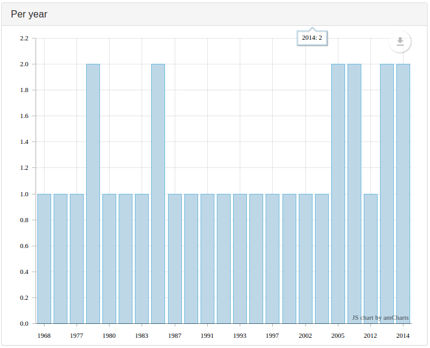

Used to represent evolution of the number of documents along the time (so,
this field is often a publication year, or anything indicating a point in
time).

Possible configuration: [`size`](Preferences.md#size), and [`color`](Preferences.md#color).

If you want to display the holes in time too (e.g., year with no documents),
add `"parseDates": true` (default value: `false`) in the configuration:

```javascript
      {
        "field": "content.json.year",
        "type": "histogram",
        "title": "Per year",
        "parseDates": true
      }
```

If you want to shorten the field value to display on the chart, use a `labels`
associative array to replace too long fields values with shorter ones:

```javascript
      {
        "field": "fields.Themes",
        "type": "histogram",
        "title": "Themes (histogram)",
        "maxItems" : 10,
        "labels": {
          "Biology & Biochemistry"    : "Bio & Bio",
          "Pharmacology & Toxicology" : "Pharmaco & Toxico",
          "Plant & Animal Science"    : "Plant & Animal"
        }
      },
```

### overlay

If you want to superimpose a new series of values to the one already displayed
in columns (but as a line), you can use the `overlay` property of an
`histogram`.

You have to indicate a `label` and a `flying` array.

The `flying` is a [flyingFields](FlyingFields.md) that return an array of elements containing:

- `_id`: the identifier of the column
- `value`: the height of the column
- `value2`: the value to be displayed in the line

Example: to display an histogram the number of documents (publications) per
year, *overlayed* by a line containing the citations per year.

```javascript
 "corpusFields": {
    "$publiPerYear": {
      "$?": "local:///compute.json?operator=distinct&field=Year",
      "parseJSON": true,
      "select": ".data :nth-child(n)"
    },
    "$citationsPerYear": {
      "$?": "local:///compute.json?operator=sum_field1_by_field2&field=NbCitations&field=Year",
      "parseJSON": true,
      "select": ".data :nth-child(n)"
    }
  },
  "flyingFields": {
    "$publiCitationPerYear": {
      "zip": ["publiPerYear","citationsPerYear"],
      "foreach": {
        "$value": {
          "get": "publiPerYear"
        },
        "$value2": {
          "get": "citationsPerYear"
        },
        "mask": "_id,value,value2"
      }
    }
  },
  "dashboard": {
    "charts": [
      {
        "fields": ["content.json.Py"],
        "type": "histogram",
        "title": "Années & citations",
        "help": "Nombre total de publications et de citations par année",
        "size": {
          "height": 400
        },
        "color": "#5496cf",
        "overlay": {
          "label": "Citation ratio:",
          "firstOnly": true,
          "flying": [ "publiCitationPerYear" ]
        }
      }
    ]
  }
```

> **Warning:** using facets with an overlay (which is computed from
> `corpusFields`) is not a good idea: the selected facets will not modify
> the chart, as other chart types do.

<a id="firstonly"></a>
The `firstOnly` property is here to prevent the URL to return a `data`
containing an array containing an array with only one element, which the chart
won't interpret correctly.

If you don't see anything on the chart, try inverting the value of `firstOnly`
(false by default).

In the example, if you omit `"firstOnly": true`, the URL will be http://localhost:3000/compute.json?o=distinct&f=content.json.Py&ff=publiCitationPerYear&itemsPerPage= and return a `data` like:

```json
[
  [
    {
      "_id": "2007",
      "value": 5,
      "value2": 868
    },
    {
      "_id": "2008",
      "value": 3,
      "value2": 39
    },
    {
      "_id": "2009",
      "value": 4,
      "value2": 46
    },
    {
      "_id": "2010",
      "value": 1,
      "value2": 5
    },
    {
      "_id": "2011",
      "value": 1,
      "value2": 106
    }
  ],
  [
    {
      "_id": "2007",
      "value": 5,
      "value2": 868
    },
    {
      "_id": "2008",
      "value": 3,
      "value2": 39
    },
    {
      "_id": "2009",
      "value": 4,
      "value2": 46
    },
    {
      "_id": "2010",
      "value": 1,
      "value2": 5
    },
    {
      "_id": "2011",
      "value": 1,
      "value2": 106
    }
  ],
  [...],
  [...],
  [...]
]
```

which ezVIS can't project on the chart. If you use `"firstOnly": true`, the
URL will be http://localhost:3000/compute.json?o=distinct&f=content.json.Py&firstOnly=true&ff=publiCitationPerYear&itemsPerPage=
and will return a `data` like:

```json
[
  {
    "_id": "2007",
    "value": 5,
    "value2": 868
  },
  {
    "_id": "2008",
    "value": 3,
    "value2": 39
  },
  {
    "_id": "2009",
    "value": 4,
    "value2": 46
  },
  {
    "_id": "2010",
    "value": 1,
    "value2": 5
  },
  {
    "_id": "2011",
    "value": 1,
    "value2": 106
  }
]
```

Example with a `"firstOnly": false`, each `normalizeCitationRatioPerYear`
treatment will be applied to an object containing a year (`_id`) and a number
of publications (`value`):

```json
{
  "dashboard": {
    "charts": [{
      "fields": ["content.json.Py"],
      "type": "histogram",
      "title": "Years & normalized citations ratio",
      "help": "Total number of publications and normalized citations ratio per year",
      "overlay": {
        "label": "Normalized citation ratio per year:",
        "flying": [ "normalizeCitationRatioPerYear" ]
      }
    }]
  },
  "flyingFields": {
    "$normalizeCitationRatioPerYear": {
      "$cpy": {
        "get": "citationsPerYear",
        "array2object": true
      },
      "$citations": {
        "getpropertyvar": ["cpy","_id"]
      },
      "$globalCitation":{
        "getpropertyvar": ["globalCitationRatios","_id"]
      },
      "$value2": {
        "compute": "citations / value / globalCitation"
      },
      "mask": "_id,value,value2"
    }
  }
}
```
