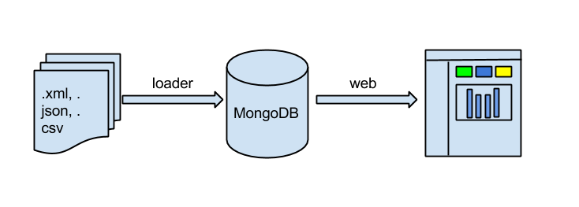

By default, ezVIS is able to load CSV files (each line being a document).

# Settings

Here is the default settings:

```javascript
  "loaders": [
    {
      "script": "castor-load-csv",
      "pattern": "**/*.csv"
    }
  ]
```

These settings mean that all `.csv` files within the data directory (and all
its descendants, thanks to `**/`) will be loaded by
[`castor-load-csv`](https://github.com/castorjs/castor-load-csv).

You can add any castor loader you find in
[castorjs repositories](https://github.com/castorjs?query=castor-load)
(except [castor-load](https://github.com/castorjs/castor-load), which manages
(all loaders).

For example, to enable ezVIS to load XML files, each containing several
documents (in `/RDF/Topic`), use:

```javascript
  "loaders" : [
    {
      "script" : "castor-load-xmlcorpus",
      "pattern" : "**/*.xml",
      "options" : {
        "cutter" : "/RDF/Topic"
      }
    }
  ]
```

There is an example of TSV settings in the 
[showcase](https://github.com/madec-project/showcase).

# Loaded matter

After the creation of a file in the data directory (upload, or copy, or any other method of creation), or even after a modification of any file in that directory, the loader reads the file(s), and convert it(them) to JSON in order to be synchronized with the Mongo database.



Most of the record consists of file metadata:

```bash
$ mongo castor
MongoDB shell version: 2.6.10
connecting to: castor
> db.films.findOne()
{
  "_id" : ObjectId("557560eabb9f1ab60a95abad"),
  "dateConfig" : ISODate("2015-06-08T09:28:20Z"),
  "dateLoaded" : ISODate("2015-07-08T12:57:12.125Z"),
  "basedir" : "/home/parmentf/dev/castorjs/getting-started-with-ezvis/films",
  "filetype" : "file",
  "fid" : "4fbf5beaa9fee526c1c3aa2e79afc98523c2dbae",
  "location" : "/home/parmentf/dev/castorjs/getting-started-with-ezvis/films/films.csv",
  "basename" : "films.csv",
  "filename" : "/films.csv",
  "directory" : "",
  "extension" : "csv",
  "filesize" : 3419,
  "dateCreated" : ISODate("2015-06-08T09:30:38Z"),
  "dateModified" : ISODate("2015-06-08T09:30:38Z"),
  "dateAccessed" : ISODate("2015-06-08T09:30:38Z"),
  "sha1" : "cd6fd17a1c2ef8398271990432884a46955f2dd1",
  "mountBy" : [
    "77c5f73404d8fb01a2d81125f9959354",
    "77c5f73404d8fb01a2d81125f9959354",
    "496127a0d8997ac28679fe3c877bd76a",
    "1c3c724ed318b6e9c7b3a3ed19a90f6c",
    "91f7b97399588405b964203a0b6290d5"
  ],
  "fileSize" : "3.3 kB",
  "fileFormat" : "text/csv",
  "name" : "films",
  "text" : "",
  "content" : {
    "json" : {
      "title" : "Rocky",
      "year" : "1976",
      "director" : "John G. Avildsen",
      "actors" : "Sylvester Stallone/Talia Shire/Carl Weathers/Burt Young"
    }
  },
  "number" : 1,
  "wid" : "Zew2pQ",
  "state" : "unmodified",
  "dateSynchronised" : ISODate("2015-07-08T13:03:47.897Z")
}
> 
```

Notice, however, the `content.json` part of the record: it is the location for the content of the file. Most of the time, the loaders will produce a `content.json`. Sometimes it will only be a `content.raw` (the raw text content of the file), like with [castor-load-raw](https://github.com/castorjs/castor-load-raw).

Notice that the [documentFields](DocumentFields.md) or even [corpusFields](CorpusFields.md) can use any field in the record to yield their own content, mixing it with [operators](Operators.md) and [JBJ](JBJ.md) actions.

Example with the previous record:

```json
  "documentFields": {
    "$title": {
      "visible": true,
      "label": "Title",
      "path": "content.json.title"
    },
    "$year": {
      "visible": true,
      "label": "Year",
      "path": "content.json.year"
    },
    "$director": {
      "visible": true,
      "label": "Director",
      "path": "content.json.director"
    },
    "$actors": {
      "label": "Actors",
      "path": "content.json.actors",
      "parseCSV" : "/",
      "foreach": {
        "trim": true
      }
    },
    "$vactors": {
      "label": "Actors",
      "path": "actors",
      "join": ", "
    },
    "$text": {
      "get" : ["title", "year", "director", "actors"],
      "join": "|"
    }
  }
```

will produce:

```json
{
  "text" : "Rocky|1976|John G. Avildsen|Sylvester Stallone,Talia Shire,Carl Weathers,Burt Young",
  "title" : "Rocky",
  "year" : "1976",
  "director" : "John G. Avildsen",
  "actors" : [
    "Sylvester Stallone",
    "Talia Shire",
    "Carl Weathers",
    "Burt Young"
  ],
  "vactors" : "Sylvester Stallone, Talia Shire, Carl Weathers, Burt Young",
}
```

which will be added to the record itself.
